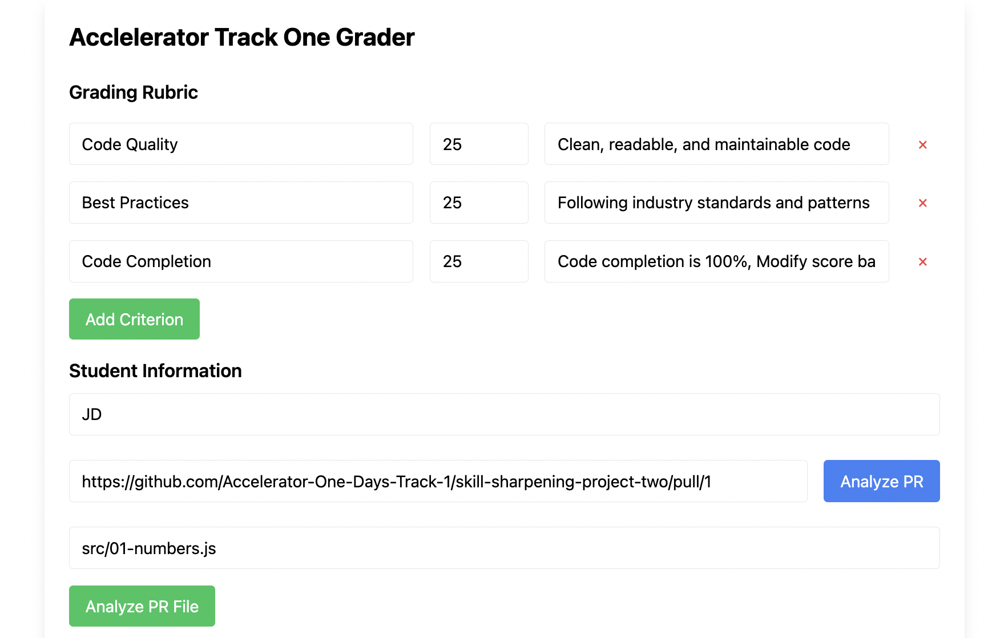
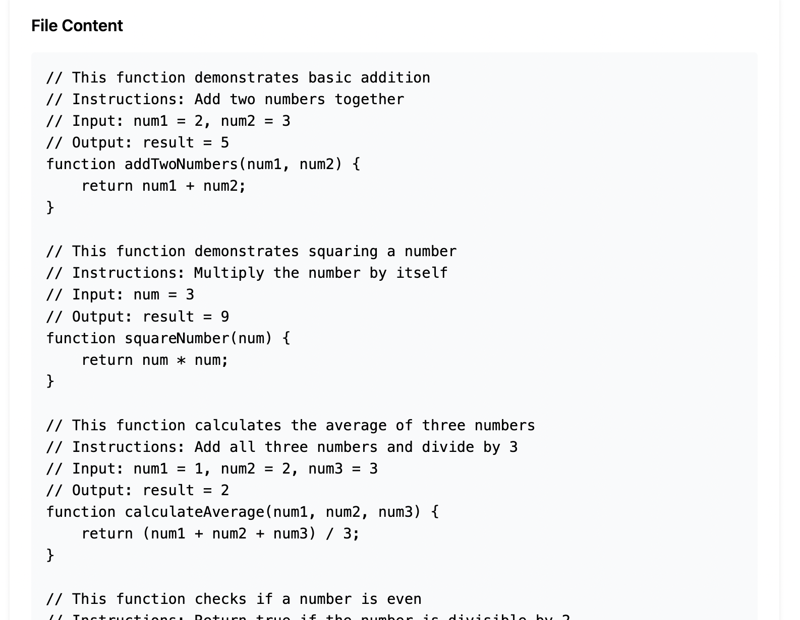

# GitHub PR Code Analyzer Frontend

This is the frontend for the GitHub PR Code Analyzer. It is built with React and Vite.

Demo Video:

## Images

## Features

- Create and customize grading rubrics with weights and descriptions
- Input GitHub PR URLs for analysis
- Input a GitHub repo URL and file path to analyze a single file within a repo PR
- add Rubric Criteria and weights
- View analysis results including:
  - Files changed statistics
  - Line additions/deletions
  - Scores based on custom criteria
  - Export results as text file
  - Copy results to clipboard

## Getting Started

1. Clone the repository
2. Run `npm install` to install the dependencies
3. Run `npm run dev` to start the development server

  The Backend is required to be running for the frontend to work.

  The Backend can be found [here](https://github.com/jason-s-dev/ai-grader-backend)
